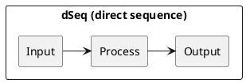
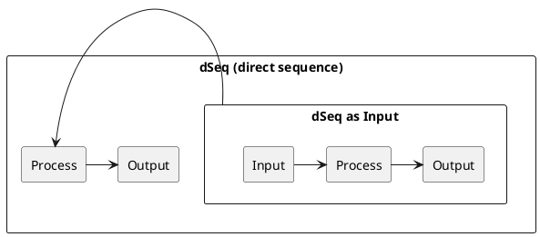
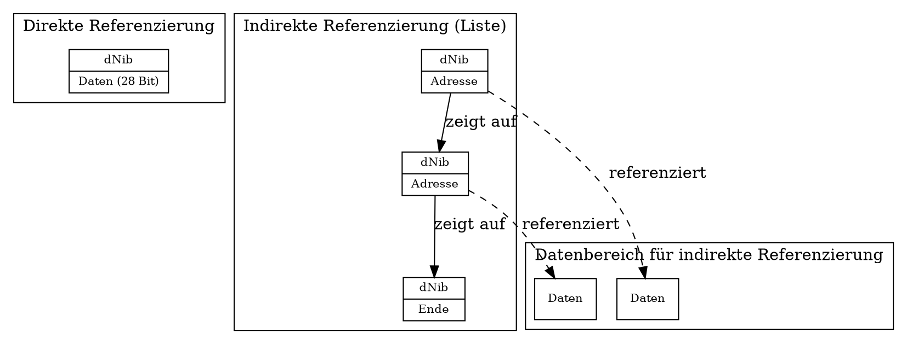
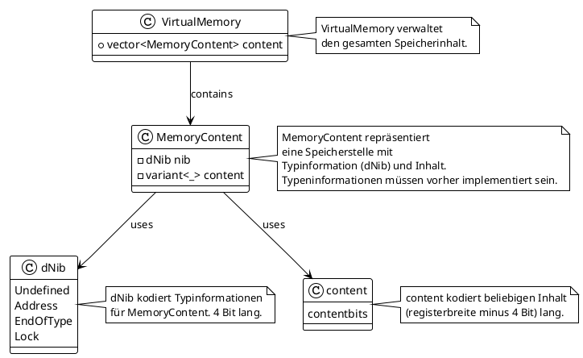

# mDm: move da' machine
- A Comprehensive Guide to a Structured Programming Language Paradigma -

## Abstract
The mDm programming language stands as a testament to the continuous evolution and innovation within the field of software development, aiming to bridge the gaps highlighted by the deficiencies in existing programming paradigms and languages. As outlined in the extensive discussion on the principles behind mDm, this language seeks to address the challenges of structured programming, modularity, and expressiveness, while incorporating the necessary feedback mechanisms and reducing the modeling gap that exists between the problem domain and the software solution.
Vielmehr kann mit mDm jedes Problem strukturiert und in kleinere Teilprobleme aufgespalten werden. Visavice können Teillösungen zu einem größeren Ganzen kombiniert werden.

The integration of feedback mechanisms and the emphasis on reducing the modeling gap through expressive syntax and constructs in mDm reflect an understanding of the need for programming languages and environments to be more closely aligned with the way systems are conceptualized and designed. This is in line with the vision outlined by Krasemann, where the development process is supported by tools that provide instant feedback, allow for the direct manipulation of program structures, and support a seamless transition between design and implementation phases.

By emphasizing a structured approach to programming through the IPO model and direct sequences (dSeq), mDm not only simplifies the process of software development but also encourages clarity and predictability in program behavior. This adherence to structured programming principles ensures that developers can create more maintainable, readable, and robust applications, addressing some of the core deficiencies identified by Floyd and others regarding the need for a rich set of paradigms supported by programming languages.

Moreover, mDm's use of macros, groupings, and the scope operator ::: facilitates a level of modularity and reusability that is essential for modern software development practices. This approach aligns with the vision of creating a comprehensive language workbench where domain-specific languages (DSLs) and meta-programming play a crucial role in tailoring the programming environment to the specific needs of the problem domain.

In summary, mDm represents a forward-thinking approach to programming language design, one that seeks to embody the principles and vision for future programming paradigms and environments. By addressing the deficiencies of current languages, providing mechanisms for modularity and expressiveness, and emphasizing the importance of feedback and reduced modeling gaps, mDm offers a glimpse into the potential future of software development. As we continue to explore and innovate within the realm of programming languages, mDm serves as a valuable step toward realizing a more expressive and efficient  programming environment.
([source] 07.05.2006
 Anforderungen an eine Programmiersprache
 H. Krasemann)

## Introduction

Programming languages serve as the cornerstone of software development, translating human logic into machine-executable instructions. mDm emerges as a language built on the structured paradigm of input, processing, and output (IPO) modules, as a classic van neumann architecture computes. We name this tripartite dSeq (direct sequence). This architecture facilitates a clear separation of concerns, modular design, and enhanced readability, setting the stage for efficient and error-minimized coding practices.
While no existing programming language directly matches the unique combination of features and paradigms proposed for mDm, many languages incorporate elements that resonate with its core principles. The design of mDm, as discussed, reflects a synthesis of structured programming, type safety, modularity, and an explicit IPO model, drawing inspiration from both functional and systems programming languages to address modern software development challenges. Gerade die modularität wird jedes auszudrückendes Problem expliziter angegangen. 

### Core Concepts

#### IPO Model
Alle Zuammenhänge können durch die kleinstmögliche Definition im Ausdruck beschrieben. Quasi Top down.
At the heart of mDm lies the IPO model, which segments programs into three distinct phases: input, processing, and output. Each phase, or dState of direct sequence, adheres to a strict sequence, ensuring a linear and logical progression through the program. This model not only simplifies the design and implementation of algorithms but also aligns closely with the computational theory, enhancing the language's intuitive appeal to developers.
The IPO (Input, Processing, Output) model is a fundamental principle in mDm, organizing programs/modules/types into three sequential phases: input, processing, and output. This model simplifies algorithm design and aligns with computational theory, enhancing intuitiveness for developers. Das Prinzip ist somit auch auf alle designbaren strukturen anwendbar, bis zu den gefürchteten "Black Boxes" und hinein.


#### dSeq
das IPO paradigma ist selbstklärend. dennoch sollten einige begrifflichkeiten erwähnt und erklärt werden. Wie die: dSeq, or direct sequence, represents the structured execution flow in mDm, encompassing the IPO model's phases within a single construct.
  ```mDm
  data, process, result
  ```


dSeq (direct sequence)s bestehen immer(!) aus den 3 schritten:
 dSeq (direct sequence) = EINGABE, VERARBEITUNG, AUSGABE
trennung der schritte durch ,. die schritte werden dState genannt.
dSeq (direct sequence)s sind in sich geschlossen und es wird immer von einem dState sequenziell in dieser reihenfolge zum nächsten gesprungen. somit steht die eingabe oder parameter für eine operation vor der verarbeitung. das ergebnis der verarbeitung liegt instantan am ausgang an.
dSeq (direct sequence)s können geklammert werden (EINGABE, VERARBEITUNG, AUSGABE) um sie verschachtelt in anderen dSeq (direct sequence)s zu verwenden.
dSeq (direct sequence)s ist der einzige und fundamentale rechenschritt.
in diesem sinne ist eine typendefinition, eine funktion oder ein ganzes programm eine immer eine dSeq.
dSeq kann für deklerative zwecke benutzt werden oder auch zur implementierung. im programmier kontext unterscheiden sich die beiden:
dekleration: (eingabetypen),funktionsname,(ausgabetypen)
implementation: (eingangsvariabeln),(process logik), funktionsname

verschachtelung in der form:
((dState, dState, dState), dState, dState)
oder:
((dSeq, dState, dState), dSeq, dState)
sind möglich und erweitern die funktionalität der sprache. Der OUTPUT dState der einen dSeq kann an anderer Stelle oder in einem anderem Programmteil mit benutzt werden.



- **mDm Example**: Defining a sequence with input, process, and output.
  ```mDm
  (inputData), performCalculation, outputData
  ```

#### dState
dState refers to each phase within a dSeq, detailing the specific actions in the input, processing, or output stages.

- **mDm Example**: Specifying states within a dSeq.
  ```mDm
  input, validateInput, processed
  processed, computeOutput, result
  ```

#### dNib
dNib is a conceptual tool in mDm for defining the interpretation and processing of subsequent content in memory, enhancing data management and operation precision.
The Core of Memory Interpretation
The primary mechanism for data interpretation in mDm is through dNibs, a term presumably derived from "data nibble". In typical 8-bit systems, a memory location does not inherently hold a specific data type (such as an integer, character, or address) without explicit definition. Instead, mDm uses dNibs to encode metadata about the subsequent content at a memory location, thereby directing how the content should be processed and interpreted.

A dNib provides control over the following aspects:

Whether the content is defined or undefined (_)
If it represents the last significant bit position of a data type (.)
Lock/mutex status (indicated by ~) for synchronization purposes
Reserved for future use (bit 3, currently unspecified)
For instance, here's how data might be represented using a dNib:





```graphiz
digraph G {
    node [shape=record, fontsize=12];

    address [label="{dNib (als Adresse) | Adresse zu Daten}"];
    data1 [label="{Daten (28 Bit) | char: 'A'}"];
    data2 [label="{Daten (28 Bit) | numerical: 1234}"];
    data3 [label="{Daten (28 Bit) | Adresse zu weiteren Daten}"];
    string [label="... | char[n]: '!'"];

    address -> data1;
    address -> data2;
    data3 -> string;
}

```

Memory Representation with 
[dNibs](snippets/dNibs.mDm)
[memoryInterpretation](snippets/memoryInterpretation.mDm)

Data Types as First-Class Citizens
In mDm, even fundamental data types like integers (int), floating-point numbers (float), and characters (char) are treated as constructs that must be explicitly interpreted using functions or type definitions. There is no inherent meaning to raw memory content; it gains significance only when paired with a type-defining dSeq (direct sequence) or function.

By rejecting implicit content assumptions, mDm promotes type safety, making each operation on the data intentional and explicit. This strictness necessitates clear type definitions and operations, minimizing the risk of type errors and reducing the complexity associated with casting between types.

Ensuring Type Safety
Ensuring type safety is a cornerstone of mDm's design. Each operation that retrieves or manipulates memory content must include validation against the expected type, as encoded by the preceding dNibs. This additional layer of verification acts as a safeguard against mismatches between the intended and actual use of data.

```mDm
/// Validate memory content as an integer before proceeding
(0x01, _, memoryLocation), validateInt, safeIntOperation
```

Conclusion
The inclusion of dNibs in mDm establishes a methodical and secure framework for managing memory, effectively addressing one of the most prevalent sources of programmatic errors in software development. By mandating explicit definitions and operations, mDm leverages structured programming principles to enforce clarity, predictability, and reliability in code execution.
##### Dynamische Speicherverwaltung

Durch die Möglichkeit, Daten entweder direkt oder über Adressverweise (indirekt) zu speichern, kann das System dynamisch entscheiden, wie und wo Speicher alloziert wird. Für kleine Datenwerte, die direkt neben dem dNib passen, kann Speicherplatz eingespart werden, da keine zusätzlichen Verweise nötig sind. Größere Datenstrukturen oder solche, die dynamisch wachsen können, wie Listen oder Strings, nutzen indirekte Referenzierung, wodurch die Allokation von Speicher nach Bedarf und in variablen Größen möglich wird.
##### Effiziente Nutzung des Speichers

Die Trennung von Metadaten (dNib) und Daten ermöglicht eine effizientere Nutzung des Speichers. Da das dNib Informationen über den Datentyp und die Struktur trägt, kann der Speicher genau nach den Erfordernissen der Datenallokation angepasst werden, was zu einer Minimierung von verschwendetem Speicherplatz führt. Beispielsweise können leere oder undefinierte Bereiche leicht identifiziert und wiederverwendet oder überschrieben werden, ohne umfangreiche Garbage Collection durchführen zu müssen.
##### Vereinfachung der Speicherfreigabe

Die klare Kennzeichnung von Datenende und Typ durch das dNib erleichtert die Freigabe von Speicher. Wenn ein Datenblock nicht mehr benötigt wird, kann das System das dNib untersuchen, um zu bestimmen, wie und wo die Daten gespeichert sind (direkt oder indirekt), und den entsprechenden Speicher freigeben. Dies ist besonders nützlich in Umgebungen mit manueller Speicherverwaltung, kann aber auch automatisierte Garbage Collection-Verfahren unterstützen.
##### Unterstützung für komplexe Datenstrukturen

Die Verwendung von Adressverweisen ermöglicht die Erstellung komplexer, verknüpfter Datenstrukturen, wie verkettete Listen, Bäume und Graphen, ohne die Notwendigkeit, die gesamte Struktur in einem kontinuierlichen Speicherblock zu halten. Dies erleichtert die Allokation von Speicher für neue Elemente, da nur der Speicher für das Element selbst und nicht für die gesamte Struktur allokiert werden muss. Zudem können Strukturelemente im Speicher verteilt werden, was die Speichernutzung optimiert.
##### Optimierung für spezifische Anwendungsfälle

Durch die flexible Handhabung der Speicherallokation können Anwendungen spezifische Optimierungen vornehmen, beispielsweise indem häufig genutzte Datenstrukturen im Voraus alloziert und wiederverwendet werden. Dies reduziert die Notwendigkeit für ständige Allokationen und Freigaben von Speicher und verbessert die Gesamtleistung der Anwendung.
##### Verbesserung der Speicherzugriffszeiten

Indem Daten entsprechend ihrer Nutzung und Größe effizient im Speicher verteilt werden, können Speicherzugriffszeiten optimiert werden. Direkt referenzierte Daten bieten schnellen Zugriff für kleine Datenmengen, während indirekt referenzierte Strukturen die Flexibilität bieten, große und komplexe Daten effizient zu verwalten.

- **mDm Example**: Using dNib for data interpretation.
  ```mDm
  (address, dNib::Type, content), defineData, usage
  ```

##### Implicit is Wack!
Promoting explicit definitions over implicit assumptions, this principle in mDm aims to eliminate uncertainties in data type interpretation and usage.
Eine detaillierte Erläuterung des Typsystems von mDm, einschließlich der unterstützten Datentypen (wie Integer, Float, String, Listen, usw.), sowie Regeln für Typkonversion und Typinferenz.
mDm's approach to programming language design is ambitious and innovative, drawing inspiration from structured programming principles and incorporating modern features like macros, groupings, and advanced data handling. Let's dive into the detailed syntax description and how type declarations for common data types are structured in mDm, reflecting on its distinctive paradigm that focuses on input, processing, and output (dSeq (direct sequence)s).

- **Type Annotations in dSeq (direct sequence)s**: In defining dSeq (direct sequence)s, type annotations can be used to explicitly declare the types of inputs, processing steps, and outputs. This clarity supports mDm's goal of making each dSeq (direct sequence) self-contained and understandable.
- **Type Safety in Modular Design**: The modular design of mDm, with its emphasis on modules, packages, and namespaces, would leverage type safety to ensure that interfaces between different parts of the program are correctly used and that data is appropriately shared or isolated.
- **Type Inference for Ease of Use**: Type inference would be particularly useful in making mDm code concise and expressive, especially when writing complex operations or algorithms where the types can be clearly inferred from the context.
- 
- **mDm Example**: Explicitly defining a variable type.
  ```mDm
  (42, int, myVariable)
  ```

### Legacy Compare

#### Function body
Das Kapitel über Funktionskörper in der mDm Programmiersprache illustriert die Art und Weise, wie Funktionen definiert und verwendet werden. In mDm wird jede Funktion oder dState (direkte Sequenz) als eine Struktur mit drei Hauptteilen betrachtet: Eingabe, Verarbeitung und Ausgabe. Dies folgt dem grundlegenden Prinzip von mDm, das Programmieren durch klare und strukturierte Abläufe zu vereinfachen.

Die Definition einer Funktion in mDm folgt dem Schema:

```mDm
FUNKTIONSPARAMETER,(
    FUNKTIONSKÖRPER
),FUNKTIONSNAME
```

Dies entspricht dem Modell: Eingabe, Verarbeitung, Ausgabe. An der Speicherstelle `FUNKTIONSNAME` liegt das Ergebnis, also der Returnwert der Funktion, als letzter Verarbeitungsschritt an. 
Ein einfaches Beispiel könnte eine Funktion sein, die zwei Zahlen addiert, gleich einer Dekleration:

[math](snippets/math.mDm)

In diesem Beispiel sind `a` und `b` die Eingabeparameter für die Funktion. Der Funktionskörper führt die Addition durch (`a + b`), und das Ergebnis dieser Verarbeitung wird unter dem Funktionsnamen `addiere` abgelegt.
Um eine solche Funktion aufzurufen und das Ergebnis zu nutzen, könnte der Code wie folgt aussehen, gleich einer implementierung:
Hier werden `5` und `3` als Eingabeparameter an die Funktion `addiere` übergeben. Das Ergebnis der Addition wird in der Variablen `ergebnis` gespeichert.

#### Importing
mDm streamlines external dependencies and modular programming with straightforward import syntax.
The language simplifies external dependencies and modular programming through its import constructs, allowing for the inclusion of libraries and modules with a straightforward syntax. This approach to dependency management streamlines code organization and reuse.

mDm defines clear rules for importing and exporting code elements to manage dependencies and ensure that only the necessary parts of a module or package are exposed to the rest of the program.

- **Importing**: When a module or package needs to use functions, classes, or other elements defined elsewhere, it can import them using mDm's import statement. The import mechanism specifies how and which components of a module or package can be accessed by others, promoting loose coupling and high cohesion within and across modules.

  - To import a module or specific functionalities from a module, mDm uses syntax that might look similar to `(iostream; string), import, IO`, where `iostream` and `string` are the modules or functionalities being imported, and `IO` is an optional alias to refer to the imported entities.

- **Exporting**: Modules and packages in mDm specify what functionalities they make available to other parts of the program or to other programs. Exporting is controlled through specific statements that declare which dSeq (direct sequence)s, functions, or classes can be used externally. This ensures that internal details of a module or package can remain hidden, exposing only a defined interface to the outside world.

  - An export statement in mDm clearly marks which components are intended for external use, potentially using syntax. existing of dSeq (direct sequence)s in same memory region, they are inherent exported, cause of all dSeq (direct sequence)s are public in that memory. outside of own memory region, the dSeq (direct sequence)s arn't resolved.

- **mDm Example**: [Importing a module](snippets/importExample.mdm).

#### Declaring (Variables / Types)
Variable and type declarations in mDm follow a structured syntax, enhancing clarity and modularity.
Eine detaillierte Erläuterung des Typsystems von mDm, einschließlich der unterstützten Datentypen (wie Integer, Float, String, Listen, usw.), sowie Regeln für Typkonversion und Typinferenz.
mDm's approach to programming language design is ambitious and innovative, drawing inspiration from structured programming principles and incorporating modern features like macros, groupings, and advanced data handling. Let's dive into the detailed syntax description and how type declarations for common data types are structured in mDm, reflecting on its distinctive paradigm that focuses on input, processing, and output (dSeq (direct sequence)s).

- **Type Annotations in dSeq (direct sequence)s**: In defining dSeq (direct sequence)s, type annotations can be used to explicitly declare the types of inputs, processing steps, and outputs. This clarity supports mDm's goal of making each dSeq (direct sequence) self-contained and understandable.
- **Type Safety in Modular Design**: The modular design of mDm, with its emphasis on modules, packages, and namespaces, would leverage type safety to ensure that interfaces between different parts of the program are correctly used and that data is appropriately shared or isolated.
- **Type Inference for Ease of Use**: Type inference would be particularly useful in making mDm code concise and expressive, especially when writing complex operations or algorithms where the types can be clearly inferred from the context.


The declaration of common data types in mDm emphasizes the language's structured and modular design. Here are examples of how various data types can be declared:

[Type example](snippets/types.mDm)


Um auf Basis des dNib-Konzepts in mDm weitere Datentypen wie char, string, numerical, fraction, und list zu deklarieren, wobei jedem Wert ein dNib vorangestellt ist, kann man die Speicherstruktur und -interpretation entsprechend planen. Angesichts einer 32-Bit-Architektur, bei der nach Abzug des dNib 28 Bit für den eigentlichen Wert verbleiben, ergeben sich interessante Möglichkeiten für die Darstellung und Verwaltung dieser Typen. Hier ein Überblick über eine mögliche Implementierung dieser Datentypen unter Berücksichtigung des dNib:
Char

    Ein char könnte direkt in den verbleibenden 28 Bit gespeichert werden, wobei das dNib Informationen über den Typ (z.B. dass es sich um ein Zeichen handelt) und möglicherweise über die Codierung enthält. Bei Bedarf könnten Zeichen, die mehr als 28 Bit erfordern, über mehrere Speicherstellen verteilt werden, mit einem fortlaufenden dNib, das anzeigt, dass das Zeichen über die erste Speicherstelle hinausgeht.

##### String

    Ein string würde aus einer Sequenz von char bestehen, wobei jedes Zeichen sein eigenes dNib besitzt. Das EndOfTyp-dNib am Ende des Strings signalisiert das Ende der Zeichenkette. Für längere Texte, die mehrere Speicherstellen benötigen, würden fortlaufende dNibs die Zugehörigkeit zum gleichen String anzeigen, bis ein dNib mit der Markierung EndOfType das Ende kennzeichnet.

##### Numerical

    Numerische Typen (int, float etc.) würden ähnlich behandelt. Ein numerical könnte in 28 Bit oder über mehrere Speicherstellen für größere Genauigkeit oder Wertebereiche verteilt werden. Das dNib würde hierbei den Typ (z.B. Ganzzahl oder Fließkommazahl) und das Ende der Zahl (EndOfType) markieren.

##### Fraction

    Eine fraction (Bruch) könnte als zwei numerical Werte dargestellt werden, einer für den Zähler und einer für den Nenner, jeweils mit eigenen dNibs. Ein drittes dNib könnte das Ende der fraction markieren und somit die beiden Teile als zusammengehörig definieren.

##### List

    Eine list wäre eine Sequenz von Werten (z.B. char, numerical, andere lists), wobei jedes Element durch ein dNib gekennzeichnet ist. Das Ende einer Liste würde durch ein EndOfType-dNib gekennzeichnet. Für verschachtelte Listen würde jedes Listenelement sein eigenes dNib haben, das den Beginn einer neuen Liste markiert, gefolgt von den Elementen dieser Unternliste, bis ein EndOfType-dNib das Ende anzeigt.

###### Complex Types (Struct-like)
mDm allows for the definition of complex data types, akin to structs in C or objects in other object-oriented languages. This can be done by defining a sequence of elements, each with its own type and identifier, grouped together:

This syntax showcases mDm's unique approach to programming language design, focusing on clarity, modularity, and the seamless integration of structured programming principles. It's designed to encourage developers to think about the flow of data through their programs, making the development process more intuitive and aligned with computational theory.

##### Defining Complex Data Types

mDm supports the definition of complex data types through a sequence of elements, each characterized by its own IPO schema. This feature exemplifies the language's strong typing and modular design principles, enabling precise and clear data modeling.
zusammen gesetzte datentypen, d.h. sie werden in mDm durch () gebildet, siehe Complex Types:

```mDm
((1,int,zaehler);(2,int, nenner)), fracture, afracture
```

```mDm
((_,char,_);(2,int, length)), string, astring
```

gleiches gilt für: dSeq (direct sequence)s, list, ...

In the conceptual framework of mDm, type safety and type inference are critical features designed to enhance the language's reliability, readability, and ease of use. These features align with mDm's overarching goals of structured programming, modularity, and clarity.

#### Counting
Demonstrates handling numeric operations and counters in mDm.


- **mDm Example**: Incrementing a counter.
  ```mDm
  (counter; 1), add, counter
  ```

#### Operating
Showcases basic arithmetic and logical operations within the structured syntax of mDm.
mDm's capability to perform arithmetic operations is shown in this straightforward example, demonstrating the language's approach to basic mathematical tasks.

By specifying the inputs, operation, and output, mDm maintains clarity and precision in expressing arithmetic, adhering to its structured programming model.

#### Conditions
Conditional statements in mDm allow for decision-making based on dynamic data.
zur weiteren verarbeitung müssen bedingungen erfüllt sein. sind sie
nicht erfüllt, sind sie für dSeq (direct sequence)s nicht wahr. mit dem '_' undefined
macro können sie weiter verarbeitet werden, mit undefinierten
verhalten. weitere verarbeitungsschritte sind notwendig, um '_' auf
wahren inhalt zu prüfen und für die weitere verarbeitung entscheidbar
zu machen.
Implementing conditional logic in mDm, this example handles decision-making based on user input, showcasing the language's support for dynamic and conditional operations.

Control structures, including conditional statements, are represented in mDm using a similar dSeq (direct sequence) syntax, which integrates seamlessly with the language's structured programming approach. Conditionals are defined by specifying the condition as part of the input, the evaluation as the process, and the consequent action as the output.

This snippet illustrates a conditional check on `userInput` to determine if it is greater than or equal to 18, and prints "Adult" if the condition is true.

The conditional operation `if >=` demonstrates mDm's ability to execute different paths based on runtime conditions, a crucial feature for responsive programs.
mDm handles loops, control structures, iteration, and recursion within its unique framework of dSeq (direct sequence)s and the IPO (Input, Processing, Output) model, adhering to its structured approach to programming. The language's design principles facilitate clear and concise representation of these constructs, emphasizing modularity and predictability. 

[Condition examples](snippets/conditions.mDm)

#### Looping
Loop constructs in mDm facilitate iterative operations within the IPO model.

- **mDm Example**: Looping through a list.
  ```mDm
  (_, (index; size(myList)), while <, (myList[index], processItem, _)), _
  ```

##### Looping with conditions

mDm introduces a unique syntax for conditional statements and loops, maintaining its commitment to the IPO structure while accommodating control flow mechanisms essential for practical programming. These constructs allow developers to implement decision-making and iterative processes within the rigid framework of dSeq (direct sequence)s, striking a balance between structure and flexibility.

'for'-schleifen sind nicht notwendig. mit 'while' lassen sich alle
bedingungen und schleifenkörber konstrukte abbilden.

[Loop with while](snippets/looping.mDm)

Loops in mDm are implemented through dSeq (direct sequence)s that specify the conditions for iteration. The language uses a structured approach to define loop conditions and actions, aligning with the IPO model. For instance, a `while` loop construct might look like this:

This example demonstrates a loop that increments `counter` until it is less than 10, showcasing how loop conditions and bodies are defined within the dSeq (direct sequence) framework.
Looping is a fundamental aspect of programming, allowing for repeated execution of a block of code. This example outlines a simple loop structure in mDm.

Here, the `while <` construct illustrates how mDm implements loops, using its structured syntax to define loop conditions and actions clearly.


##### Iteration

Iteration over collections like lists or arrays is handled through dSeq (direct sequence) constructs that allow for accessing and manipulating elements in a sequence. mDm's syntax for iteration is designed to work with its structured approach, enabling developers to specify the operation to be performed on each element of the collection.

```mDm
/// Variable
0, int, counter
(1;2;3;4;5), list, myList

/// Iteration Construct
(counter; size(myList)), while <, (
    (myList; counter), at, currentItem
    /// Process currentItem here
)
```

This example shows how iteration can be implemented to access each item in `myList` using a counter.

##### Recursion

Recursion in mDm is handled by allowing functions (dSeq (direct sequence)s) to call themselves within their processing phase. The structured nature of mDm requires that recursive calls be clearly defined within the IPO model, ensuring that each recursive step is treated as a discrete dSeq (direct sequence).

```mDm
/// Recursive Function Definition
(n), factorial, result
(n; 1), if <=, (1, return, result)
(n; (n;1), factorial, _), mul, result
```

In this recursive example, the `factorial` function calls itself with `n-1` until `n` is less than or equal to 1, demonstrating how recursion fits within the dSeq (direct sequence) paradigm.

mDm's approach to loops, control structures, iteration, and recursion emphasizes its core philosophy of clear, structured, and modular programming. By integrating these constructs within the IPO model and dSeq (direct sequence)s framework, mDm offers a unique and powerful tool for software development, encouraging developers to think in terms of discrete processing steps and data flow.


#### Error Handling
Error handling in mDm is managed through structured constructs, ensuring programs can gracefully manage exceptions.

- **mDm Example**: Handling potential errors in operations.
  ```mDm
  (inputData), riskyOperation, result | errorFlag; (errorFlag), if _, (handleError, _)
  ```

For each section, a corresponding Graphviz DOT diagram can be conceptualized to visually represent the described concepts, such as the flow of a dSeq with nodes for input, processing, and output phases. Due to the limitations here, I recommend using software capable of Graphviz DOT language or an online tool to create and visualize these diagrams based on the described structures.

## Conclusion

Throughout our session today, we delved deeply into the mDm programming language, a novel approach to structured programming that emphasizes the Input, Processing, Output (IPO) model. This exploration revealed mDm's core philosophy of making programming both intuitive and rigorous, aiming to reduce complexity and enhance clarity in software development.

mDm introduces several innovative concepts such as dSeq (direct sequence), dState, and dNib, which collectively offer a structured methodology for defining program logic, managing data, and interpreting memory content. These constructs allow for a high degree of modularity and reusability, enabling developers to create clear, maintainable, and efficient code.

One of the language's standout features is its insistence on explicit definitions over implicit assumptions, as encapsulated in the principle "Implicit is wack!" This design choice aims to eliminate the uncertainties often associated with type inference and dynamic typing, thereby reducing security vulnerabilities and making code behavior more predictable.

The language also demonstrates a thoughtful approach to error handling, leveraging structured constructs to manage errors gracefully and ensure robust program operation even in the face of unexpected inputs or states. This is indicative of mDm's overarching goal: to provide a solid framework that supports not just the technical aspects of programming, but also the conceptual clarity needed to tackle complex software development challenges.

Moreover, mDm's syntax and semantics encourage a paradigm shift in how we think about programming languages. By integrating the structured programming model with modern programming needs, mDm offers a pathway to a more disciplined yet flexible approach to coding. It challenges developers to think in terms of discrete processing steps and data flows, aligning closely with computational theory while also addressing practical software development needs.

In conclusion, our exploration of mDm today has unveiled a language with the potential to significantly impact how programmers approach software development. Its emphasis on structure, clarity, and modularity, coupled with innovative features for handling data and operations, positions mDm as a promising tool for the future of programming. As the language continues to evolve, it will undoubtedly inspire further discussion and experimentation within the programming community, pushing the boundaries of conventional coding paradigms and fostering a more rigorous and intuitive approach to software design and implementation.

## References

- [mDm Programming Language](https://github.com/dingste/mDm)
- [mDm Programming Language Documentation](hhttps://github.com/dingste/mDm/The_mDm_reference.md)