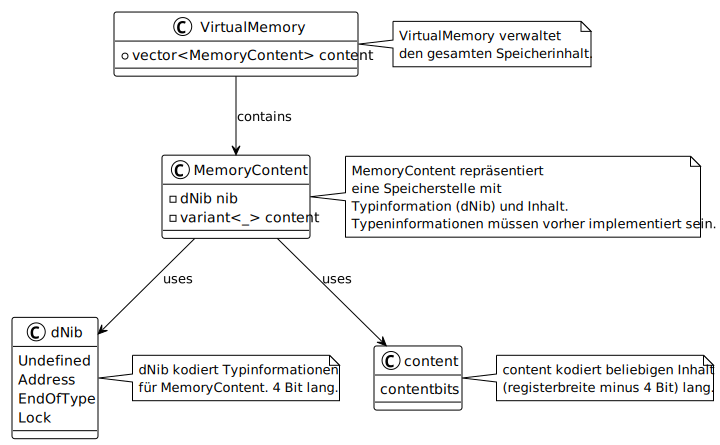

dNib is a conceptual tool in mDm for defining the interpretation and processing of subsequent content in memory, enhancing data management and operation precision.
The Core of Memory Interpretation
The primary mechanism for data interpretation in mDm is through dNibs, a term presumably derived from "data nibble". In typical 8-bit systems, a memory location does not inherently hold a specific data type (such as an integer, character, or address) without explicit definition. Instead, mDm uses dNibs to encode metadata about the subsequent content at a memory location, thereby directing how the content should be processed and interpreted.

A dNib provides control over the following aspects:

Whether the content is defined or undefined (_)
If it represents the last significant bit position of a data type (.)
Lock/mutex status (indicated by ~) for synchronization purposes
Reserved for future use (bit 3, currently unspecified)
For instance, here's how data might be represented using a dNib:



Memory Representation with 
[dNibs](snippets/dNibs.mDm)
[memoryInterpretation](snippets/memoryInterpretation.mDm)

Data Types as First-Class Citizens
In mDm, even fundamental data types like integers (int), floating-point numbers (float), and characters (char) are treated as constructs that must be explicitly interpreted using functions or type definitions. There is no inherent meaning to raw memory content; it gains significance only when paired with a type-defining dSeq (direct sequence) or function.

By rejecting implicit content assumptions, mDm promotes type safety, making each operation on the data intentional and explicit. This strictness necessitates clear type definitions and operations, minimizing the risk of type errors and reducing the complexity associated with casting between types.

Ensuring Type Safety
Ensuring type safety is a cornerstone of mDm's design. Each operation that retrieves or manipulates memory content must include validation against the expected type, as encoded by the preceding dNibs. This additional layer of verification acts as a safeguard against mismatches between the intended and actual use of data.

```mDm
/// Validate memory content as an integer before proceeding
(0x01, _, memoryLocation), validateInt, safeIntOperation
```
The inclusion of dNibs in mDm establishes a methodical and secure framework for managing memory, effectively addressing one of the most prevalent sources of programmatic errors in software development. By mandating explicit definitions and operations, mDm leverages structured programming principles to enforce clarity, predictability, and reliability in code execution.
