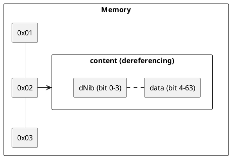
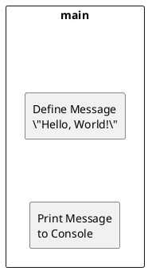
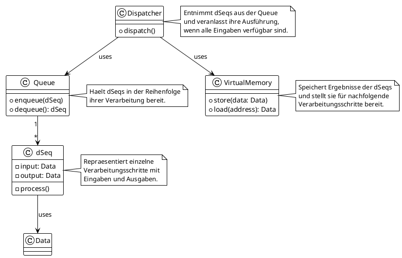

ich möchte zur neuartigen programmiersprache 'mDm' dieses kapitel stringenter (roter faden) ausführen. fasse den inhalt zusammen, füge unterkapitel ein, setze von mir gemachte vergleiche in dall-e um, benutze die plantuml auszeichnungssprache um technische zusammenhänge in dem kapitel visuell zusammenzufassen. deine neue fassung ist in markdown geschrieben. deine neue fassung ist in englisch. jedes kapitel auch als dSeq (direct sequence) in der headline nach dem format (<seitennummer>,<mDm>,<kapitelname>). Hier das kapitel:


#### Detailed Syntax Description

The foundation of mDm lies in its dSeq (direct sequence)s, a tripartite structure representing the core steps in program execution: input, processing, and output. These are separated by commas, emphasizing the sequential flow from one state to the next within a program. The syntax is designed to ensure clarity, modularity, and maintainability in software development.
Eine präzise Beschreibung der Syntaxregeln von mDm, einschließlich der Definition von Variablen, Funktionen, Bedingungen, Schleifen, und wie externe Module importiert werden. Dies sollte Beispiele für jede syntaktische Struktur umfassen.

|char(s)|meaning|
|---|---|
|///|one line comment identifier|
|,|delimiter of dStates in an dSeq|
|( )|encapsulation/grouping of dSeq|
|;|delimiter in list|
|_|undefined marker|
|?|validator of defined or undefined dereferencing|
|~|dereference of an address|
|*|definition of an address|


##### Macros and Groupings
Macros, denoted by '_', represent undefined or dynamic steps within the IPO sequence, offering flexibility in handling variable data and operations. Groupings, indicated by '()', organize related units or operations, facilitating complex expressions and structured command sequences. The ':::' notation further extends this concept to inheritance, scope definition, and derivations, enriching the language's capability to model complex software architectures.


### Datentypen


operatoren als macros sowie enum auflösung, die länge eines jeden operators ist 1 bit:

```mDm
(_;?;*;~), enum, operator
```
|operator|meaning|
|---|---|
|_ | is undefined |
|? | dereference|
|. | last data|
|* | adressoperator|
|~ | Lock (sofern die adresse noch von einer verarbeitung benutzt wird)|

bei einer architekturbreite von 64 bit ergeben sich folgende typen:


|name|bildung|
|---|---|
|bit| = (0; 1) |
|byte| = 8 x 1 bit |
|dNib| 4xBit |

```graphviz
digraph Speicherverwaltung {
    // Grundlegende Einstellungen für das Aussehen des Graphen
    graph [fontname = "Helvetica", fontsize = 10, rankdir=LR];
    node [fontname = "Helvetica", fontsize = 10];
    edge [fontname = "Helvetica", fontsize = 10];

    // Knoten für Speicherblöcke mit Label für Adresse und Inhalt, symmetrisch angeordnet
    node0 [shape=record, label="{Adresse: 0x01 | Inhalt: 'Daten A'}"];
    node1 [shape=record, label="{Adresse: 0x02 | Inhalt: 'Daten B'}", style=filled, fillcolor=lightblue];
    node2 [shape=record, label="{Adresse: 0x03 | Inhalt: 'Daten C'}"];
    node3 [shape=record, label="..."];
    node4 [shape=record, label="{Adresse: 0xNN | Inhalt: 'Daten N'}"];

    // Verbindung zwischen Speicherblöcken (z.B. für eine lineare oder verkettete Struktur)
    node0 -> node1 [label="Nächster"];
    node1 -> node2 [label="Nächster"];
    node2 -> node3;
    node3 -> node4 [label="Nächster"];

    // Zusätzliche Knoten und Verbindungen, um einen größeren Speicherausschnitt darzustellen
    extraNode1 [shape=record, label="...", style=dotted];
    extraNode2 [shape=record, label="...", style=dotted];
    node4 -> extraNode1 [style=dotted];
    extraNode1 -> extraNode2 [style=dotted];

    // Symmetrische Anordnung der Knoten
    //{ rank=same; node0; node1; node2; node3; node4; extraNode1; extraNode2; }

    // Kommentar im Graphen zur Erläuterung
    labelloc="t";
    label="Erweiterter Speicherausschnitt in mDm";
}
```





#### dNib
Ein dNib bestimmt die interpretation und weitere verarbeitung des nachfolgenden contents.
bit 0: _ = defined/undefined
bit 1: . = kennung der letztenbitstellen zum interpretierbaren datentyps
bit 2: ~ = lock/mutex -> content ist gesperrt
bit 3: XXX = noch nicht definiert

durch die verwendung von dNib lassen sich neben der verhaltensteuerung auch die typendefinition steuern.
z.b.

der dateninhalt (decimal: 4,61168601843e+18) an speicherstelle 0x02 bei int:
leserichtung: 0->63
|0|1|0|0| 0x0x3FFFFFFFFFFFFFFF

float existiert nicht! es wird mit brüchen (fracture) gearbeitet. dies erhöht die genauigkeit und ist zusätzlich auf architekturen ohne FPU performant.

For instance, declaring an integer variable named `counter` with an initial value of 0 would be written as:

```mDm
(0, int, counter)
```


#### Example Illustrating Type Safety and Type Inference

```mDm
/// Using Type Inference
(a; b), add, result  // The types of a, b, and result are inferred based on usage

/// Type Safety in Function Calls
_, int, sum
(5, int,_; 10, int,_), add, sum  // Explicit types ensure operations are safe
```

In this example, type inference simplifies the declaration of `add`, making the code cleaner. Type safety is evident in the explicit declaration of integer types for `5` and `10`, ensuring that the `add` operation is performed safely.

Through the integration of type safety and type inference, mDm aims to strike a balance between preventing errors and making the language accessible and efficient for developers. These features underscore mDm's commitment to producing robust, error-free code while enhancing developer productivity. Forget the others, remember the D.

##### Type Safety

mDm emphasizes type safety to prevent errors that arise from mismatched or incorrect data types. Type safety in mDm ensures that operations are performed on compatible types and that any type mismatches are caught at compile time rather than at runtime, thus reducing bugs and improving program stability.

- **Strict Type Checking**: mDm likely enforces strict type checking, where variables' types are known and checked at compile time. This approach minimizes common errors such as type mismatches and incorrect function calls.
- **Safe Type Conversion**: When type conversion is necessary, mDm would promote explicit casting over implicit conversions to prevent unexpected behavior or loss of precision. This explicitness enhances code readability and maintainability.

##### Type Inference

Type inference in mDm would allow the compiler to automatically deduce the types of variables and expressions based on the context in which they are used. This feature simplifies the coding process by reducing the verbosity of type declarations without sacrificing the benefits of type safety.

- **Contextual Typing**: The compiler uses the context in which a variable or function is used to infer its type, reducing the need for explicit type declarations while ensuring that type safety is not compromised.
- **Balancing Clarity with Convenience**: While type inference can make the code less verbose, mDm would balance this with the need for clarity. For instance, in cases where the inferred type is not immediately obvious or could lead to confusion, explicit type annotations might be encouraged to maintain readability.

    Vergleiche: Stellen Sie Vergleiche zwischen ähnlichen Datentypen an, um ihre Unterschiede und Anwendungsfälle hervorzuheben.
    Visualisierungen: Nutzen Sie Diagramme oder Tabellen, um die Beziehungen zwischen den Datentypen und ihre Speicherorganisation zu veranschaulichen.
    Best Practices: Geben Sie Richtlinien oder Best Practices für die Verwendung verschiedener Datentypen in bestimmten Situationen an.
    Erweiterte Nutzung: Erörtern Sie fortgeschrittene Themen wie Typkonvertierung, Vererbung von Datentypen oder die Definition benutzerdefinierter Datentypen.

#### Dynamic Results and Memory Management

By abstracting memory management and focusing on type-safe operations, mDm aims to minimize runtime errors and optimize resource usage. The language's design abstracts direct memory manipulation, entrusting efficiency and safety to the underlying implementation of dSeq (direct sequence)s.


##### loop and access: loopoverlist.mDm

```mDm
/// Variable
0, int, counter
(2;4;6;10;1;456), list, listofitems
_, int, output

/// Loop Construct till counter < 10
/// cause of listofitems only 6 items counts, since the 7th output will 
be _
_, ( (counter; 10), while <, (
    /// Loop Body: Increment counter
    (counter; 1), add, counter
    (listofitems;counter), at, output
) ), output
```

##### program construct: main.mDm

one mDm stands for one dSeq (direct sequence). one dSeq (direct sequence) can include endless dSeq (direct sequence)s
ergo: one function stands for one dSeq (direct sequence)

```mDm
/// example Imports
(A; B),import,ABCname

/// example Variables
_, int, counter
10, int, literal10
"some string", string, shortstring

_,(
/// something here
),inputFunction

inputFunction,(
/// something here
),processingFunction

processingFunction,(
/// something here
),outputFunction

/// a standalone function with unknown input
_,(
/// something here
),standaloneFunction

/// Main Function Block - Initializes and Starts Threads
_,(

/// concated function in an endless loop
outputFunction, while _, _

/// Standalone Function running once, with unknown input and output
standaloneFunction, while 1, _

/// Standalone Function running once, with unknown input and output
_, standaloneFunction, _

/// Standalone Function running unknown cause of unknown processing function, with unknown input
_, _, standaloneFunction

),main
```

#### Integration with C++ and mDm Concepts

- **C++ `#include` Statements for mDm Imports**: Translating mDm imports into C++ is straightforward; each mDm import would correspond to a C++ `#include` directive, incorporating external libraries or other mDm modules as needed.
- **Flexibility and Type Safety**: This design offers a starting point but would need further development to fully support all mDm features, especially around type safety and error handling for the dynamic inputs/outputs scenario.

This basic framework sets the stage for a more comprehensive implementation of an mDm interpreter in C++. Adjustments and extensions would be necessary to fully support the mDm programming model, especially for more complex scenarios involving error handling, type safety enhancements, and integrating C++ features with mDm's structured programming principles.

Given the insight that mDm type declarations like `(_, int, x)` or `(5, int, y)` map closely to C++ declarations such as `int x;` or `int y = 5;`, and acknowledging the incorrect use of `std::vector<void*>` for dynamic dSeq (direct sequence) handling, we can refine the approach to parsing and interpreting mDm in C++. Instead of using `void*` vectors, we should leverage C++'s strong typing and template capabilities to more accurately represent mDm constructs.


#### Hello World Program

A fundamental example in any programming language, the "Hello, World!" program in mDm showcases the simplicity and elegance of outputting a string to the console.

```mDm
/// Import
(iostream),import,IO

/// Main function
_,(
    "Hello, World!",string,hwstring
    hwstring,print,IO:::cout
    /// also possible
    ("Hello, World!",string,_),print,IO:::cout
),main
```



This example demonstrates the basic structure of an mDm program, including the import statement for I/O operations and the main function block. The use of `hwstring` and `IO:::cout` illustrates variable definition and standard output, respectively.

### Inheritance and Derivation

The concept of inheritance is key in object-oriented programming. mDm handles this with its unique syntax, allowing for the definition of complex types and their relationships.

```mDm
/// Definition of Enums
(undefined;dynamic),enum,_

/// Import Constructs
(iostream; string),import,STLC
(thread; mutex; condition_variable; deque),import,THREADS

/// Base Type Person
(_,string,name;_,int,age),Person,_

/// Derived Type Student, inherits from Person
(Person:::_,string,university),Student,_

/// Main Function Block
_,(

   ( "John Doe",string,Person:::name;
    30,int,Person:::age;
    "University XYZ",string,Student:::university),Student,JohnDoe

    johnDoe,printPerson,_
),main
```

This snippet illustrates mDm's approach to defining and utilizing complex data structures, including enum types, inheritance, and object instantiation. It also highlights the language's modular import system.


### **Fehlerbehandlung**

mDm addresses errors and undefined behaviors through its structured programming model, which emphasizes clarity, predictability, and safety in handling such scenarios. The language incorporates specific constructs and paradigms to manage exceptional conditions, ensuring that programs can deal with errors gracefully and maintain robust operation even in the face of unexpected inputs or states. Here's how mDm handles errors and undefined behaviors:

#### Macros and the Undefined Behavior (`_`)

In mDm, the underscore (`_`) serves as a macro for undefined or dynamic steps within the dSeq (direct sequence) sequences. This macro is particularly useful in handling cases where the behavior or output of a program segment cannot be determined at compile time. When `_` is encountered, it signifies a point in the program where special attention is needed to address potential undefined behaviors or to dynamically determine the course of action.

#### Error Handling Constructs

mDm employs structured constructs to manage errors, allowing developers to define clear paths for error detection and handling within the IPO model. Error handling in mDm can be implemented through conditional dSeq (direct sequence)s that check for error conditions and respond appropriately. This structured approach ensures that error handling is an integral part of the program's flow, rather than an afterthought.

#### Example of Error Handling

```mDm
/// Attempt to perform an operation that might fail
(inputData), riskyOperation, result | errorFlag

/// Check for error and handle accordingly
(errorFlag; true), if ==, (
    /// Error handling logic here
    "Error occurred", print, _
)
```

In this example, `riskyOperation` is a dSeq (direct sequence) that attempts to process `inputData` and produces `result` or sets an `errorFlag` if an error occurs. The subsequent conditional dSeq (direct sequence) checks `errorFlag`, and if an error is detected, executes the error handling logic.


##### Modularität und Wiederverwendbarkeit

Durch die klare Trennung von Eingabe, Verarbeitung und Ausgabe fördert mDm die Modularität und Wiederverwendbarkeit von Code. Funktionen in mDm sind selbsttragende Einheiten, die leicht in verschiedenen Teilen eines Programms oder sogar in verschiedenen Programmen wiederverwendet werden können, ohne dass der interne Aufbau der Funktion für den aufrufenden Code von Belang ist.

##### Zusammenfassung

Die Funktionsdefinition und -nutzung in mDm zeigt, wie die Sprache strukturierte Programmierung unterstützt und fördert. Durch das klare IPO-Modell (Input, Processing, Output) werden Entwickler ermutigt, ihre Programme in wohldefinierte, leicht verständliche und wiederverwendbare Einheiten zu gliedern. Dies vereinfacht nicht nur die Entwicklung und Wartung von Software, sondern trägt auch zu einer erhöhten Codequalität bei.

In mDm, functions embody the core philosophy of structured programming through their implementation as dSeq (direct sequence)s, adhering to the input, processing, and output model. This design choice not only enhances the clarity and predictability of program behavior but also streamlines the integration and manipulation of data across different parts of a program.

#### Functions as dSeq (direct sequence)s

Every function in mDm is a dSeq (direct sequence), encapsulating a specific task within the tripartite structure of input, processing, and output. This ensures a consistent and modular approach to programming, where functions can be easily understood, reused, or replaced without affecting the overall system architecture.

#### Building Custom Functions

Developers can create custom functions to perform specific tasks. These functions are defined by specifying the inputs they require, the processing steps they perform, and the outputs they produce. The syntax for defining a custom function follows the dSeq (direct sequence) model closely, making it intuitive for those familiar with mDm's core concepts.

#### Importing Functions

mDm also allows for the importation of functions from external modules or libraries, which can then be used within a program as if they were custom-defined. Imported functions adhere to the same dSeq (direct sequence) structure and can be integrated seamlessly into the flow of an mDm program. This facilitates code reuse and helps in building complex applications by leveraging pre-existing functionalities.

#### Usage as dSeq (direct sequence)s

Functions, whether custom-built or imported, are used within mDm programs as dSeq (direct sequence)s. This means they are invoked and integrated within the flow of a program through the IPO model, ensuring that data moves through the system in a structured and predictable manner. The input to a function is clearly defined, as is its output, making it easier to debug, maintain, and extend programs.

## examples

### Threads Example

Demonstrating concurrency, this example highlights mDm's ability to define and manage threads, showcasing the language's support for modern programming challenges.

```mDm
/// Import
(iostream; string),import,STLC
(thread; mutex; condition_variable; deque),import,THREADS
(deque),import,CONTAINER

/// Shared Data Structure and Synchronization Mechanisms
_,(
    _,deque<string>,dataQueue;
    _,mutex,mtx;
    _,condition_variable,cvNotEmpty;
    _,condition_variable,cvNotFull
),SharedData

/// Input Thread Function
_,(
    _,lock,SharedData:::mtx
    "Hello World",string,message
    message,push_back,SharedData::dataQueue
    _,signal,SharedData:::cvNotEmpty
    size(SharedData:::dataQueue),wait < maxSize,SharedData:::cvNotFull
),inputFunction

/// Processing Thread Function
inputFunction,(
    SharedData:::dataQueue, wait !empty,SharedData:::cvNotEmpty
    _,lock,SharedData:::mtx
    string,message,front,SharedData:::dataQueue
    SharedData:::dataQueue,pop_front,_
    _,signal,SharedData:::cvNotFull

    /// Processing logic here with 'message'
    /// ...

),processingFunction

/// Output Thread Function
processingFunction,(
    SharedData:::dataQueue,wait !empty,SharedData:::cvNotEmpty
    _,lock,SharedData:::mtx
    string,message,front,SharedData:::dataQueue
    SharedData:::dataQueue,pop_front,_
    _,signal,SharedData:::cvNotFull
    message,print,_  // Assuming 'print' is an action that outputs 'message'
),outputFunction

/// Main Function Block - Initializes and Starts Threads
_,(
    thread,inputFunction,Thread,
    thread,processingFunction,Thread,
    thread,outputFunction,Thread,
    Thread,join,_
),main
```

This comprehensive example showcases mDm's capabilities in handling concurrent operations, shared data structures, and synchronization mechanisms, illustrating the language's applicability to complex, real-world software development tasks.

### example: bubble sort

```mDm
/// Import von notwendigen Modulen
(list;print;stdout), import, UTILS

/// Definition der Liste
(5; 3; 8; 4; 2), list, numbers

/// Bubble Sort Funktion
numbers, (
    /// Initialisierung der Variablen
    true, bool, swapped
    0, int, i
    (size(numbers)-1), int, n

    /// Äußere Schleife läuft, bis keine Vertauschungen mehr vorkommen
    (swapped), while true, (
        _, swapped, false  // Setzt swapped auf false am Anfang jeder Iteration

        /// Innere Schleife für den Durchlauf durch die Liste
        (i; n), while <, (
            /// Vergleicht benachbarte Elemente
            (numbers[i]; numbers[i+1]), if >, (
                /// Tauscht Elemente, wenn sie in der falschen Reihenfolge sind
                (numbers[i]; numbers[i+1]), swap, (numbers[i+1]; numbers[i])
                _, swapped, true  // Markiert, dass eine Vertauschung stattgefunden hat
            )
            _, i,(i+1)  // Inkrementiert den Zähler
        )
    )
), bubbleSort

/// Aufruf der Bubble Sort Funktion und Ausgabe der sortierten Liste
bubbleSort, (
    numbers, print, stdout  
), main
```

### example: fibonacci zahlen (nochmal manuell überprüfen)

```mDm
/// Import von notwendigen Modulen
(map), import, DATA_STRUCTURES

/// Definition der Memoisierungsfunktion für Fibonacci-Zahlen
_, (
    /// Initialisierung der Basisfälle
    (0; 1), map, fibCache  // Speichert fib(0) = 0 und fib(1) = 1

    /// Fibonacci-Funktion
*    n, int, _  // n ist die Eingabe
*    (n), fib, int, result  // 'fib' ist die rekursive Funktion, 'result' das Ergebnis

    /// Überprüfung, ob das Ergebnis bereits im Cache ist
    (n; fibCache), containsKey, (
        /// Wenn ja, wird das Ergebnis aus dem Cache zurückgegeben
        (n; fibCache), get, result
    ), (
        /// Wenn nicht, rekursive Berechnung
        (n-1), fib, int, prev1  // fib(n-1)
        (n-2), fib, int, prev2  // fib(n-2)
        
        /// Addition der beiden vorherigen Ergebnisse
        (prev1; prev2), add, result

        /// Speichern des neuen Ergebnisses im Cache
        (n; result), put, fibCache
    )
), fib

/// Aufruf der Fibonacci-Funktion und Ausgabe des Ergebnisses
_, (
    10, int, input  // Beispiel: Berechnung von fib(10)
    input, fib, int, fibResult
    fibResult, print, _  // Angenommen, 'print' ist eine Aktion, die das Ergebnis ausgibt
), main
```

### Example Syntax for a Custom Function

```mDm
/// Custom Function Definition
(inputParam1; inputParam2), customProcessing, outputResult
```

This approach to functions reinforces mDm's commitment to structured programming, promoting readability, modularity, and efficiency in software development. By treating functions as dSeq (direct sequence)s, mDm provides a clear framework for thinking about how data is handled, processed, and passed through a system, encouraging developers to adopt a disciplined and thoughtful approach to coding.

#### The Scope Operator `:::`

The scope operator `:::` in mDm is a powerful feature that allows for the inheritance and access of dSeq (direct sequence) components, facilitating a nuanced way to organize and reference the internals of functions and variables. It enables developers to define and access the hierarchical structure within dSeq (direct sequence)s, making it possible to inherit properties, behaviors, or values from other dSeq (direct sequence)s efficiently.

#### Functions as Scoped dSeq (direct sequence)s

With the introduction of the scope operator, functions in mDm are not just isolated blocks of logic but can be seen as scoped dSeq (direct sequence)s that can inherit and share functionalities. This means that when you define a function, you can use the `:::` operator to access or override specific inputs, processing steps, or outputs from another dSeq (direct sequence), enhancing the reusability and modularity of your code.

#### Building and Importing Functions with Scope

- **Custom Functions**: When defining custom functions in mDm, the scope operator allows you to create complex, nested functions where certain functionalities can be inherited or shared. This is particularly useful for creating a library of related functions that operate on similar data types or perform related tasks.
  
- **Imported Functions**: For imported functions, the `:::` operator enables you to access and utilize specific aspects of these functions within your program. This can include overriding default behaviors, customizing inputs or outputs, or integrating imported functionalities into a larger, custom-defined dSeq (direct sequence).

### Example with Scope Operator

```mDm
/// Custom Function with Inheritance
(Person:::name; Person:::age), processPersonData, Person:::summary

/// Accessing an Imported Function with Scope
_, importedModule:::specificFunction, output
```

In this example, `Person:::name` and `Person:::age` demonstrate how the scope operator is used to access specific parts of the `Person` dSeq (direct sequence), either to pass them as inputs or to define an output based on those inputs. This illustrates the flexibility and power of mDm's scoped dSeq (direct sequence) approach, enabling intricate relationships and hierarchies within the code.

The scope operator `:::` thus adds a significant depth to mDm's structured programming model, allowing for more expressive and scalable code architectures. It encourages a thoughtful design where functions and variables are not only modular and reusable but also capable of interacting in a hierarchical and organized fashion.

## Refining the dSeq (direct sequence) Representation in C++

Let's redefine the dSeq (direct sequence) structure to more closely align with mDm's concepts, using C++ structs or classes and templates to handle dynamic inputs and outputs properly. This approach will allow us to create a more type-safe and clear representation of dSeq (direct sequence)s, addressing the previous concerns.




mDm ist eine programmiersprache mit folgenden kriterien: basiert auf der dreiteiligen Struktur EINGABE, VERARBEITUNG, AUSGABE, ergänzt durch Makros und Gruppierungen. eine typzuweisung oder ein fuktionsblock sind ebenfalls eine VERARBEITUNG. diese strukturelemente werden dStates genannt. alle 3 dStates sind nur in dieser reihenfolge zugelassen. zur programmierzeit nicht bekannte dStates werden mit einem '_' kenntlich gemacht. dStates lassen sich rekursiv verschachteln, wobei immer die gleiche reihenfolge eingehalten werden muss. Lassen Sie uns die einzelnen Aspekte näher betrachten:

    Makros (_):
        Das Symbol _ steht für einen undefinierten Eingabe-, Ausgabe- oder Verarbeitungsschritt. Dies eröffnet die Möglichkeit, dynamische oder kontextabhängige Operationen zu definieren.

    Gruppierung von Einheiten (()):
        Einheiten oder Operationen, die zusammengehören, werden mit Klammern () gruppiert. Dies ermöglicht es, komplexe Ausdrücke und Anweisungen zu strukturieren. vererbung, ableitungen und scope bestimmung werden mit ':::' kenntlich gemacht.

    Beispiel für bedingte Anweisungen:
        Die Syntax x,if >5,("groß",print,_) interpretiert sich wie folgt:
            x: Eingabeparameter.
            if >5: Verarbeitungsschritt, eine bedingte Anweisung.
            ("groß",print,_): eine Ausgabemöglichkeit, abhängig vom Ergebnis der bedingten Anweisung. Wenn x > 5, wird "groß" ausgegeben. andere sprünge sind nicht zulässig.
die anweisung muss zum eingangtyp passen, bzw. von ihm bereit gestellt werden.

eine schleife wird gleich dem schema definiert:  <schleifenanzahl>,while/for <bedingung>, _ für Schleifen und '_' für eine unendliche <Schleifenanzahl>. die ausgabe ,_ kann dynamisch erweitert werden.

    Definition komplexer Datentypen:
        Komplexe Datentypen werden durch eine Sequenz von Elementen definiert, die jeweils durch ihr eigenes Eingabe-Verarbeitung-Ausgabe-Schema charakterisiert sind.
        Beispiel: 
        ```mDm
        (_,int,ELEMENT1;_,string,ELEMENT2;_,bool,ELEMENT3),DATENTYP,NAME definiert einen komplexen Datentyp NAME vom Typ DATENTYP, bestehend aus drei Elementen unterschiedlichen Typs (Integer, String, Boolean).
```
```mDm
/// Import-Konstrukte
(iostream; string),import,STLC ///wobei STCL für den bezeichner des import steht. die verwendung von includes sähe dann so aus: /// Import-Konstrukte
(thread; mutex; condition_variable; deque),import,THREADS
(deque),import,CONTAINER
```
Dynamische Ergebnisse ohne direkte Speichermanipulation
    Abstraktion der Speicherverwaltung: Indem die Speicherverwaltung hinter abstrakten Operationen verborgen wird, kann mDm die Effizienz und Sicherheit der Speichernutzung gewährleisten, ohne dass der Entwickler direkt eingreifen muss.

Typgeprüfte Operationen: Jede Operation, die auf Daten angewendet wird, sollte zur Kompilierzeit auf Typkompatibilität geprüft werden, um Laufzeitfehler zu vermeiden.
Zustandsmanagement: Der Verweis auf dStates (verarbeitungs-teil) ermöglicht es, den Programmzustand explizit zu handhaben und zu modifizieren, basierend auf den Ergebnissen der Verarbeitung. 
Konversionsregeln: sofern der eingang eines dStates nicht explizit ausgewiesen ist, bleibt er _ eine typenkonvertierung findet nicht statt. konvertierungen sind durch komplexe datenstrukturen und feiner granulierten dStates zu realisieren.

# mDm: Ein Leitfaden und Referenz

mDm stellt einen innovativen Ansatz in der Welt der Programmiersprachen dar, der sich durch eine klare Strukturierung in Eingabe, Verarbeitung und Ausgabe (dStates) auszeichnet. Diese Sprache zielt darauf ab, Entwicklern ein stark typisiertes, flexibles und effizientes Werkzeug für die Softwareentwicklung an die Hand zu geben. In diesem Leitfaden erforschen wir die Kernkonzepte und Definitionen von mDm, erörtern ihre Turing-Vollständigkeit und schließen mit praktischen Beispielen ab.

## Kernkonzepte von mDm

### dStates: Die Grundbausteine
In mDm wird jeder Teil eines Programms als dState definiert, der eine von drei Kategorien zugeordnet ist: Eingabe, Verarbeitung oder Ausgabe. Diese Struktur fördert eine modulare und intuitive Herangehensweise an die Programmierung.

- **Eingabe (Input)**: Definiert die Daten, die in das Programm eingespeist werden.
- **Verarbeitung (Processing)**: Umfasst die Logik und Operationen, die auf die Eingabedaten angewendet werden.
- **Ausgabe (Output)**: Bestimmt, wie die Ergebnisse der Verarbeitung dargestellt oder weitergegeben werden.

### Dynamische Ergebnisse und Speicherverwaltung
mDm verzichtet auf eine explizite, vom Programmierer manipulierbare Speicherverwaltung und setzt stattdessen auf eine abstrakte Handhabung von Speicher und dynamischen Ergebnissen. Typüberprüfungen zur Kompilierzeit und eine abstrakte Speicherverwaltung sorgen für Sicherheit und Effizienz.

### Typsicherheit und Konversionsregeln
Als stark typisierte Sprache legt mDm großen Wert auf Typsicherheit. Typkonvertierungen müssen explizit durch den Entwickler definiert werden, wodurch unbeabsichtigtes Verhalten vermieden wird.

## Turing-Vollständigkeit
Mit der Einführung von Schleifen, bedingten Anweisungen und variabler Manipulation erfüllt mDm die Kriterien für Turing-Vollständigkeit. Dies bedeutet, dass mDm theoretisch jedes berechenbare Problem lösen kann.

## Referenzimplementierungen für übliche dStates

### Schleifen und Bedingungen
Schleifen werden durch ein spezielles Konstrukt definiert, das die Anzahl der Wiederholungen und eine Bedingung für die Durchführung der Schleife angibt. Unendliche Schleifen sind durch den Einsatz eines speziellen Symbols (`'_'`) möglich.

```mDm
/// Unendliche Schleife
_, while true, _
```

### Typgeprüfte Operationen
Operationen in mDm werden zur Kompilierzeit auf Typkompatibilität geprüft. Dies stellt sicher, dass nur zulässige Operationen auf bestimmte Datentypen angewendet werden.

### Zustandsmanagement
mDm verwendet dStates, um den Zustand eines Programms zu verwalten. Dies ermöglicht eine klare Strukturierung und einfache Anpassung des Programmflusses basierend auf dynamischen Ergebnissen.

## Beispiele

### Vererbung/Ableitung
```mDm
/// Definition des Enums '_'
(undefined;dynamic),enum,_
/// Definition des Enums '?'
(succes;error),enum,?

/// Import-Konstrukte
(iostream; string),import,STLC
(thread; mutex; condition_variable; deque),import,THREADS

/// Basistyp Person
(_,string,name;_,int,age),Person,_

/// Abgeleiteter Typ Student, erbt von Person
(Person:::_,string,university),Student,_

/// Hauptfunktionsblock
_,(

   ( "John Doe",string,Person:::name;
    30,int,Person:::age;
    "University XYZ",string,Student:::university),Student,JohnDoe

    johnDoe,printPerson,_
),main
```

### Vererbung/Ableitung (äqivalent in C++)
```C++
#include <iostream>
#include <string>

// Definition des Enums '_'
enum class _ {
    Undefined,
    Dynamic
};

// Basisklasse Person
class Person {
public:
    std::string name;
    int age;

    Person(const std::string& name, int age) : name(name), age(age) {}
};

// Abgeleitete Klasse Student, erbt von Person
class Student : public Person {
public:
    std::string university;

    Student(const std::string& name, int age, const std::string& university)
        : Person(name, age), university(university) {}
};

// Funktion, um die Informationen einer Person auszugeben
void printPerson(const Person& person) {
    std::cout << "Name: " << person.name << ", Age: " << person.age << std::endl;
}

// Hauptfunktionsblock
int main() {
    Student johnDoe("John Doe", 30, "University XYZ");

    printPerson(johnDoe);

    return 0;
}
```

### Hello World!
```mDm
/// Import
(iostream),import,IO

/// Main function
_,(
    "Hello, World!",string,hwstring
    hwstring,print,IO:::cout
    /// also possible
    ("Hello, World!",string,_),print,IO:::cout
),main
```

### Threads example
```mDm
/// Import
(iostream; string),import,STLC
(thread; mutex; condition_variable; deque),import,THREADS
(deque),import,CONTAINER

/// Gemeinsame Datenstruktur und Synchronisationsmechanismen
_,(
    _,deque<string>,dataQueue;
    _,mutex,mtx;
    _,condition_variable,cvNotEmpty;
    _,condition_variable,cvNotFull
),SharedData

/// Eingabe-Thread-Funktion
_,(
    _,lock,SharedData:::mtx
    "Hello World",string,message
    message,push_back,SharedData::dataQueue
    _,signal,SharedData:::cvNotEmpty
    size(SharedData:::dataQueue),wait < maxSize,SharedData:::cvNotFull
),inputFunction

/// Verarbeitungs-Thread-Funktion
inputFunction,(
    SharedData:::dataQueue ,wait !empty,SharedData:::cvNotEmpty
    _,lock,SharedData:::mtx
    string,message,front,SharedData:::dataQueue
    SharedData:::dataQueue,pop_front,_
    _,signal,SharedData:::cvNotFull

    /// Verarbeitungslogik hier mit 'message'
    /// ...

),processingFunction

/// Ausgabe-Thread-Funktion
processingFunction,(
    SharedData:::dataQueue,wait !empty,SharedData:::cvNotEmpty
    _,lock,SharedData:::mtx
    string,message,front,SharedData:::dataQueue
    SharedData:::dataQueue,pop_front,_
    _,signal,SharedData:::cvNotFull
    message,print,_  // Annahme: 'print' ist eine Aktion, die 'message' ausgibt
),outputFunction

/// Hauptfunktionsblock - Initialisiert und startet Threads
_,(
    thread,inputFunction,Thread,
    thread,processingFunction,Thread,
    thread,outputFunction,Thread,
    Thread,join,_
),main
```

### Einfache Rechenoperationen
```mDm
/// Definition der Variablen
3, int, x
4, int, y
_, int, z

/// Addition
(x;y), add, z

/// Multiplikation
(x;y), mul, z
```

### Bedingte Logik
```mDm
/// Eingabe
_, int, nutzerAlter

/// Verarbeitung mit bedingter Anweisung
(nutzerAlter; 18), if >=, ("Volljährig", print,_)
```

### Schleifenkonstrukt
```mDm
/// Zählervariable
0, int, counter

/// Schleifenkonstrukt
(counter; 10), while <, (
    // Schleifenkörper: Erhöhe counter
    (counter; 1), add, counter
)
```
Transforming this comprehensive overview of the 'mDm' programming language into a more structured format with a clearer narrative, visual comparisons, and technical diagrams in Markdown requires a detailed approach. We'll break down the content into refined subsections, provide visualizations where appropriate, and summarize technical connections using PlantUML. The revision aims to enhance readability, understanding, and engagement with 'mDm's innovative features.

---

# mDm Programming Language Overview

## Abstract (1, mDm, Abstract)

The mDm programming language introduces a groundbreaking framework for software development, characterized by its unique tripartite structure of input, processing, and output modules, enhanced by macros and groupings. This document explores mDm's foundational principles, emphasizing how its design fosters clarity, modularity, and flexibility in programming. By analyzing its core concepts like dStates, macros, and complex data type definitions with practical examples, we evaluate mDm's position in the programming languages landscape, its advantages, and potential applications.

## Introduction (2, mDm, Introduction)

Programming languages are pivotal in translating human logic into machine-executable instructions. mDm stands out with its structured paradigm of input, processing, and output (IPO) modules, known as dStates, supplemented by macros and groupings. This architecture enhances readability, facilitates modular design, and promotes efficient, error-minimized coding practices. mDm's design reflects a blend of structured programming, type safety, modularity, and an explicit IPO model, drawing from both functional and systems programming languages to address modern software development challenges.

## Core Concepts of mDm (3, mDm, Core Concepts)

### The IPO Model and dStates

At mDm's core lies the IPO model, segmenting programs into distinct phases: input, processing, and output. Each phase, or dState, follows a strict sequence, simplifying algorithm design and implementation and aligning with computational theory to enhance the language's intuitiveness for developers.

#### Detailed Syntax Description

mDm's syntax centers on dStates, representing program execution's core steps: input, processing, and output. These steps are clearly separated, underscoring the sequential flow from one state to the next, ensuring clarity, modularity, and maintainability.

#### Type Safety and Type Inference

mDm integrates type safety within its structured programming paradigm, using type annotations in dStates for clear declarations and leveraging type safety in modular design. Type inference simplifies code, making mDm robust and user-friendly.

### Macros and Groupings

Macros (`_`) offer flexibility in handling variable data and operations within the IPO sequence. Groupings (`()`) organize related units, enhancing mDm's capability to model complex software architectures.

#### Datatypes

mDm's type system includes support for various data types (e.g., Integer, String, Lists) and rules for type conversion and inference, emphasizing the language's structured and modular design.

### Conditional Statements and Loops

mDm introduces unique syntax for conditional statements and loops, accommodating control flow mechanisms within the structured framework of dStates.

### Error Handling

mDm addresses errors and undefined behaviors through structured programming, emphasizing clarity and safety in handling exceptional conditions.

### Integration with C++ and mDm Concepts

mDm's design principles facilitate clear and concise representation of programming constructs, emphasizing modularity and predictability. The language's structured approach to functions, using dStates, promotes readability and efficiency.

## Conclusion (4, mDm, Conclusion)

mDm marks a significant advancement in programming language design, offering a structured, intuitive, and flexible framework for developers. Its adherence to the IPO model, enhanced by macros and groupings, sets mDm apart as a powerful tool for creating clear, modular, and efficient code. As mDm evolves, its innovative approach promises to make a lasting impact on the programming community, challenging traditional coding paradigms and encouraging a shift towards more structured, understandable, and reliable software development practices.

---

For visualizations and technical diagrams, we'd typically employ DALL-E and PlantUML. However, given the nature of this platform, we'll describe the intended visualizations instead:

- **DALL-E Visualization**: A side-by-side comparison of traditional programming flow versus mDm's structured approach, highlighting the clarity and modularity of dStates.
- **PlantUML Diagram**: A flowchart depicting the relationship between input, processing, and output in mDm's dState model, alongside visuals for macros and groupings to demonstrate their role in structuring complex software architectures.

This revised chapter offers a more structured, comprehensive overview of 'mDm', facilitating a deeper understanding of its principles, syntax, and potential impact on software development practices.


    Fehlerbehandlung: Das Dokument skizziert Ansätze zur Fehlerbehandlung, insbesondere die Nutzung von Makros für undefiniertes Verhalten. Eine detailliertere Ausarbeitung von Fehlerbehandlungsmustern und Best Practices könnte die Robustheit von mDm-Anwendungen erhöhen.


    Parallelverarbeitung und Konkurrenz: Die Behandlung von Threads und synchronisierten Datenstrukturen wird angesprochen, aber eine tiefere Diskussion über Konzepte der Parallelverarbeitung und Konkurrenz, inklusive Beispiele für effiziente Muster und Strategien, könnte die Anwendung von mDm in hochperformanten Systemen fördern. z.b.
		    Einfaches Thread-Management: Ein Beispiel, das zeigt, wie Threads für die parallele Ausführung von unabhängigen Berechnungen erstellt und verwaltet werden. Hier könnte ein einfaches Szenario illustriert werden, in dem mehrere Daten gleichzeitig verarbeitet werden, um die Leistung zu verbessern.

    Synchronisierte Datenstrukturen: Demonstration der Verwendung synchronisierter Datenstrukturen, um Race Conditions zu vermeiden. Das Beispiel könnte einen gemeinsamen Ressourcenzugriff durch mehrere Threads illustrieren, wobei Synchronisationsmechanismen wie Mutexe oder Semaphoren zum Einsatz kommen.

    Futures und Promises: Ein Szenario, in dem Futures und Promises verwendet werden, um das Ergebnis einer asynchronen Operation zu behandeln. Dies könnte zeigen, wie man nicht-blockierende Operationsabläufe gestaltet, die die Anwendungsreaktivität erhöhen.
		In mDm könnten Futures und Promises folgendermaßen konzipiert sein, um die speziellen Operatoren zu nutzen:

1. **Definition eines Future:** Ein Future könnte als Container für einen Wert definiert werden, der zu einem späteren Zeitpunkt gesetzt wird. Unter Verwendung von `_` für undefinierten Speicherinhalt könnte ein Future initialisiert werden, um anzudeuten, dass sein Wert noch nicht verfügbar ist.

```mDm
var futureValue: Int = _ // Initialisiert mit undefiniertem Inhalt
```

2. **Setzen eines Wertes:** Sobald der Wert verfügbar ist, könnte `~` verwendet werden, um den Wert sicher in den Future einzutragen, indem sichergestellt wird, dass der Speicherinhalt gültig ist.

```mDm
futureValue = ~42 // Setzt den Wert des Future auf 42
```

3. **Überprüfung des Inhalts:** Um zu überprüfen, ob der Future einen Wert enthält, könnte der `?` Operator verwendet werden. Dies würde eine Prüfung des Speicherinhaltes realisieren, um festzustellen, ob der Wert des Future bereits gesetzt wurde.

```mDm
if (futureValue ?) {
    // Logik, falls der Wert verfügbar ist
}
```

4. **Zugriff auf den Wert:** Der Operator `*` könnte genutzt werden, um auf die Adresse des Speicherinhaltes zuzugreifen, ohne den Inhalt zu dereferenzieren. Dies wäre nützlich, um Referenzen auf den Future-Wert zu übergeben, ohne den aktuellen Wert zu beeinflussen.

```mDm
var reference = *futureValue // Erhält die Adresse des Future-Wertes
```

5. **Abrufen des Wertes:** Der Wert eines Futures könnte mit `~` abgerufen werden, um sicherzustellen, dass auf einen gültigen und gesetzten Wert zugegriffen wird.

```mDm
var result = ~futureValue // Abrufen des gesetzten Wertes
```

Diese Konzepte würden die einzigartigen Sprachfeatures von mDm nutzen, um eine intuitive und sichere Handhabung von asynchronen Operationen zu ermöglichen. Forget the others, remember the D.


    Actor-Modell: Ein Beispiel, das das Actor-Modell implementiert, um eine Nachrichtenbasierte Kommunikation zwischen verschiedenen Teilen eines Systems zu ermöglichen. Hierbei könnten Actors definiert werden, die Nachrichten empfangen, verarbeiten und darauf reagieren, was insbesondere für die Entwicklung verteilter Systeme nützlich ist.

    Erweiterte Typsysteme: Die Dokumentation enthält Informationen über Basisdatentypen und komplexe Typen. Die Hinzufügung von Beispielen für erweiterte Typsystemfeatures wie Algebraische Datentypen, Interfaces oder Generics könnte die Sprache flexibler und ausdrucksstärker machen.

    Entwicklerwerkzeuge und Ökosystem: Eine Diskussion über geplante oder vorhandene Werkzeuge (wie IDE-Integration, Debugging-Tools, Paketmanager) und ein Überblick über das Ökosystem (Community, Bibliotheken, Frameworks) könnten hilfreich sein, um Entwickler zu unterstützen und die Akzeptanz zu erhöhen.

    Best Practices und Designmuster: Das Dokument könnte von einem Abschnitt profitieren, der Best Practices und empfohlene Designmuster für die Entwicklung mit mDm vorstellt, um Entwicklern Richtlinien für effiziente und wartbare Anwendungen an die Hand zu geben.
--- nicht beachten brainstorming zur umsetzung in asembler ---
---
(einfügen, wo es passt)

    
## ALU register (info)
Allgemeine Register (x86_64)
Register	Beschreibung
RAX	Akkumulator für arithmetische Operationen
RBX	Basisregister, für Datenzugriff verwendet
RCX	Zählregister für Schleifen
RDX	Datenregister, für I/O Operationen

## assembler conversion
    Assembler Syntax: Verstehen Sie die Syntax und die Befehlssätze von x86_64, um mDm-Anweisungen effektiv in Assemblercode zu übersetzen.
    Registerverwendung: Kennen Sie die Funktionen und Best Practices für die sowie der speziellen Register für Floating-Point-Berechnungen und Vektoroperationen.
    Speicheroperationen: Implementieren Sie effiziente Speicherzugriffs- und -managementstrategien unter Berücksichtigung der Stack- und Heap-Organisation in x86_64.
    Kontrollstrukturen: Entwickeln Sie Methoden zur Umsetzung von mDm-Kontrollstrukturen (Schleifen, Verzweigungen) unter Einsatz von Sprung- und Vergleichsbefehlen.
    Optimierungen: Erkunden Sie Möglichkeiten zur Codeoptimierung, um die Ausführungsgeschwindigkeit und Speichernutzung zu verbessern, beispielsweise durch Inline-Assembly in kritischen Bereichen.
    

Befehlssätze von x86_64 (Vereinfachte Übersicht)
Befehlskategorie	Beschreibung
Datenübertragung	Befehle für das Laden, Speichern und Übertragen von Daten zwischen Registern und Speicher.
Arithmetische Operationen	Befehle für Addition, Subtraktion, Multiplikation und Division.
Bitweise Operationen	AND, OR, XOR, NOT Operationen.
Sprungbefehle	Bedingte und unbedingte Sprünge, Schleifenkontrollbefehle.
Funktionsaufrufe	CALL und RET Befehle für Funktionsaufrufe und -rückkehr.

link http://ctoassembly.com/#
z.b.
#include <stdio.h>

int main() {
    printf("Hello World!\n");
 int x = 1; 
 x = x + 2; 
 return x; 
}
section .data
    helloMessage db 'Hello World!', 10 ; 10 is the newline character

section .bss
    x resb 1

section .text
    global _start

_start:
    ; Print "Hello World!\n"
    mov eax, 4          ; syscall number for sys_write
    mov ebx, 1          ; file descriptor 1 is stdout
    mov ecx, helloMessage ; message to write
    mov edx, 13         ; message length
    int 0x80            ; call kernel

    ; x = 1
    mov byte [x], 1
 

z.b.
Data transfer instructions
MOV  src, dest 	copies the source (src) operand to destination (dest) operand
LEA  src, dest 	calculates the address of the src operand and loads it into the dest operand
PUSH src 	copies the src to the top of the stack
POP  dest 	copies a value from the top of the stack to the dest
Control flow instructions
CMP  arg1, arg2 	subtracts the arg2 from the arg1 and sets flag bits
JEQ  label 	jumps to the address specified by the label if operands of previous CMP instruction are equal (ZF = 1)
JNE  label 	jumps if operands are not equal (ZF = 0)
JLE  label 	jumps if arg1 is lower or equal than arg2 (ZF = 1 or SF different from OF
JGE  label 	jumps if arg1 is greater or equal than arg2 (SF equal to OF)
JLT  label 	jumps if arg1 is lower than arg2 (SF different from OF)
JGT  label 	jumps if arg1 is greater than arg2 (ZF = 0 and SF equal to OF)
CALL label 	pushes the address of the instruction to the stack and jumps to a location specified by the label
RET  	pops the stack into the instruction pointer
Arithmetic instructions
ADD  arg1, arg2, dest 	sum of arg1 and arg2 is stored into the dest operand
SUB  arg1, arg2, dest 	subtracts arg2 from arg1 and stores the result into the dest operand
MUL  arg1, arg2, dest 	multiplies arg1 and arg2 and stores the result into the dest operand. Multiplication overflow is stored to 12th register
DIV  arg1, arg2, dest 	divides arg1 with arg2 and stores the result into the dest operand. Remainder is stored to 12th register
INC  src 	increments src
DEC  src 	decrements src
Shift instructions
SHL  arg1, arg2, dest 	logically shifts arg1 to the left by arg2 bits and stores the result into the dest operand
SHR  arg1, arg2, dest 	logically shifts arg1 to the right
Logical instructions
AND  arg1, arg2, dest 	logical bitwise AND between arg1 and arg2. The result is stored into the dest operand
OR   arg1, arg2, dest 	Logical bitwise OR
XOR  arg1, arg2, dest 	Logical bitwise exclusive OR
NOT  src 	Logical bitwise inversion of src
Operands

An instruction can have zero to three operands. Operands are separated by commas (,). For instructions with two operands, the first (lefthand) operand is the source operand, and the second (righthand) operand is the destination operand (that is, source->destination).

Operands can be immediate (that is, constant expressions that evaluate to an inline value), register (a value in the processor number registers), or memory (a value stored in memory). A label operand contains the address of the actual opcode. Label operands are specified without prefix. Only jump and call instructions can use label operands.
Immediate 	are prefixed with a dollar sign $
Register 	are prefixed with a percent sign %
Memory 	are specified either by the name of a variable or by a register that contains the address of a variable. Memory references have the following syntax: variable name or offset(base)

    Offset is the displacement from segment of the desired memory value. Offset is optional
    Base and index can be any of the general 32–bit number registers

Label 	are specified without any prefix or prefixed with an at sign @
Flags

The FLAGS register is the status register that contains the current state of the processor. This register is 5 bits wide.
Zero flag (ZF) 	is used to check the result of an arithmetic operation, including bitwise logical instructions. It is set if an arithmetic result is zero, and reset otherwise
Parity (PF) 	indicates if the number of set bits is odd or even in the binary representation of the result of the last operation
Sign (SF) 	indicates whether the result of the last mathematical operation resulted in a value whose most significant bit was set
Carry (CF) 	indicates when an arithmetic carry or borrow has been generated out of the most significant bit position
Overflow (OF) 	indicates when an arithmetic overflow has occurred in an operation

